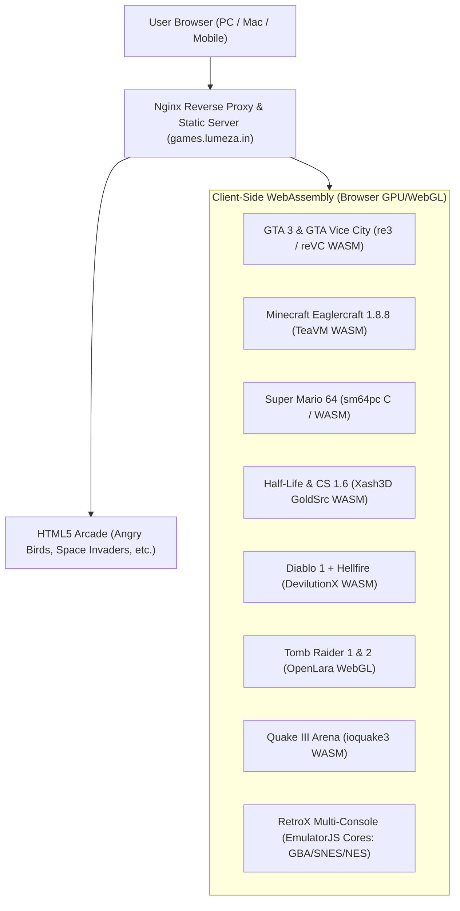
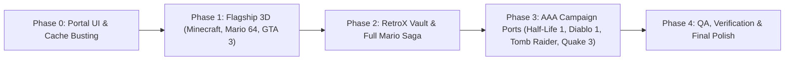

# 🎮 LUMEZA CYBER-ARCADE: ULTIMATE AAA & RETRO GAMING MASTER PLAN
**Target Host:** `https://games.lumeza.in`  
**Server Environment:** Ubuntu 20.04 LTS (IP: `92.4.75.121`)  
**Core Principles:** 100% Native Nginx Static Hosting & Client-Side WebAssembly (WASM) · **NO DOCKER** · **NO THIRD-PARTY IFRAME STREAMING** · Persistent Fullscreen Controls · Complete English Localization.

---

## 📑 TABLE OF CONTENTS
1. [Executive Overview & Architecture](#1-executive-overview--architecture)
2. [Addressing Current User Observations (Angry Birds & Cache)](#2-addressing-current-user-observations)
3. [Complete Game Catalog, Sources, and Engine Breakdown](#3-complete-game-catalog-sources-and-engine-breakdown)
   - [Category A: 3D Open World & Cinematic AAA](#category-a-3d-open-world--cinematic-aaa)
   - [Category B: Infinite Voxel Worlds & Sandbox](#category-b-infinite-voxel-worlds--sandbox)
   - [Category C: The Complete Mario Vault (3D & 2D)](#category-c-the-complete-mario-vault-3d--2d)
   - [Category D: RetroX Universal Console Emulation Hub](#category-d-retrox-universal-console-emulation-hub)
   - [Category E: Legendary First-Person Shooters](#category-e-legendary-first-person-shooters)
   - [Category F: RPG & Strategy Epics](#category-f-rpg--strategy-epics)
   - [Category G: 3D WebGL Racers & Open-Source Highlights](#category-g-3d-webgl-racers--open-source-highlights)
   - [Category H: Refined Arcade Classics](#category-h-refined-arcade-classics)
4. [File System, Directory Structure & URL Mapping](#4-file-system-directory-structure--url-mapping)
5. [Nginx Configuration & Cache-Busting Strategy](#5-nginx-configuration--cache-busting-strategy)
6. [Universal UX Standards (Fullscreen & Controls)](#6-universal-ux-standards)
7. [Step-by-Step Phased Execution Roadmap](#7-step-by-step-phased-execution-roadmap)

---

## 1. EXECUTIVE OVERVIEW & ARCHITECTURE

The objective is to elevate `games.lumeza.in` into a self-hosted gaming archive containing genuine AAA titles, 3D open-world adventures, legendary first-person shooters, the complete Mario saga, authentic Minecraft, and universal retro console emulation.



### Why This Setup Works:
- **Client-Side Computing:** Heavy 3D rendering is executed entirely by the user's local GPU using WebGL / WebGPU. The VPS does not run GPU rendering tasks.
- **Resource Footprint:** The server purely delivers static WebAssembly binaries (`.wasm`), game data bundles (`.data`), and audio files over HTTP/2.
- **Zero Third-Party Dependency:** All code, assets, audio, and ROMs reside exclusively on `/var/www/games.lumeza.in/` on your own VPS.

---

## 2. ADDRESSING CURRENT USER OBSERVATIONS

### Why Angry Birds Wasn't Immediately Visible
- **Root Cause:** Modern web browsers aggressively cache `portal.js` and `index.html`. Even though the code and directories were deployed to `/var/www/games.lumeza.in/arcade/angry-birds/`, the user's browser was still displaying the previous version of `index.html` and `portal.js` from memory cache.
- **Permanent Solution:**
  1. Add explicit cache-busting query strings to all assets in `index.html`:  
     `<script src="portal.js?v=2.0.1"></script>` and `<link rel="stylesheet" href="style.css?v=2.0.1">`
  2. Configure Nginx to serve `index.html` with:  
     `Cache-Control: "no-cache, no-store, must-revalidate"` so portal UI updates appear instantly on refresh.
  3. Ensure Angry Birds has a prominent, high-visibility card and standalone route.

---

## 3. COMPLETE GAME CATALOG, SOURCES, AND ENGINE BREAKDOWN

### Category A: 3D Open World & Cinematic AAA

| Game | Engine & Source | Architecture & Assets | Target Route |
| :--- | :--- | :--- | :--- |
| **Grand Theft Auto: Vice City** (1986) | `reVC` (from `Lolendor/reVCDOS`) | C++ decompilation compiled to WASM. Full Miami map, 1986 radio stations, Tommy Vercetti missions, 100% save ready. | `/vicecity/` (Proxy :7000) |
| **Grand Theft Auto III** (2001) | `re3` (from `hottabxp/re3`) | C++ decompilation compiled to WASM. Full Liberty City 3D map (Portland, Staunton, Shoreside), Claude Speed, original radio (Head Radio, Flashback). | `/gta3/` |
| **Tomb Raider 1 & 2** (1996/1997) | `OpenLara` by XProger | Native WebGL/WASM open-source engine. Full 3D Lara Croft acrobatic controls, modern dynamic lighting, water caustics, 60 FPS. | `/tombraider/` |

---

### Category B: Infinite Voxel Worlds & Sandbox

| Game | Engine & Source | Architecture & Assets | Target Route |
| :--- | :--- | :--- | :--- |
| **Minecraft: The Bountiful Update** (v1.8.8) | `Eaglercraft 1.8.8` (TeaVM WASM) | Real, authentic Minecraft Java 1.8.8 compiled to WebAssembly. Singleplayer survival & creative modes, Nether, The End (Ender Dragon fight), brewing, enchanting, redstone, villages, custom skins & texture packs. Local IndexedDB saves + live multiplayer server support. | `/minecraft/` |
| **ClassiCube** | `ClassiCube` WASM | High-performance C reimplementation of Minecraft Classic. Ultra-fast load (< 1 sec), runs on any mobile/low-end device with 100+ FPS. | `/classicube/` |

---

### Category C: The Complete Mario Vault (3D & 2D)

| Game | Engine & Platform | Features | Target Route |
| :--- | :--- | :--- | :--- |
| **Super Mario 64** (1996) | `sm64-wasm` / `sm64pc` (Native C/WASM) | True native 3D Nintendo 64 game compiled directly to WebGL. 60 FPS, 16:9 widescreen, native keyboard and gamepad mapping, analog camera controls. | `/mario64/` |
| **Super Mario World** (1990) | SNES Core (EmulatorJS WASM) | The definitive 16-bit 2D platformer. Yoshi, Dinosaur Land, Star Road, Cape Feather, save states. | `/mario/smw/` |
| **Super Mario All-Stars** (1993) | SNES Core (EmulatorJS WASM) | 16-bit remastered editions of *Super Mario Bros 1*, *Super Mario Bros 2*, *Super Mario Bros 3*, and *The Lost Levels*. | `/mario/allstars/` |
| **Super Mario Kart** (1992) | SNES Core (EmulatorJS WASM) | Original Mode-7 pseudo-3D kart racing classic with full cup progression. | `/mario/kart/` |
| **Super Mario World 2: Yoshi's Island** (1995) | SNES Core (Super FX2 WASM) | Hand-drawn aesthetic, egg-throwing mechanics, Baby Mario rescue. | `/mario/yoshi/` |
| **Super Mario Advance 4: Super Mario Bros. 3** (2003) | GBA Core (EmulatorJS WASM) | Enhanced Game Boy Advance edition of SMB3 with modernized sound and voice acting. | `/mario/sma4/` |
| **Mario Kart: Super Circuit** (2001) | GBA Core (EmulatorJS WASM) | 20 tracks + 20 unlockable classic tracks on handheld GBA engine. | `/mario/mksc/` |
| **Super Mario Bros.** (1985) | NES Core (EmulatorJS WASM) | The original 8-bit historic classic that launched the franchise. | `/mario/smb1/` |

---

### Category D: RetroX Universal Console Emulation Hub

| System | WebAssembly Core | Capability & ROM Support | Target Route |
| :--- | :--- | :--- | :--- |
| **RetroX Multi-System Arcade** | `EmulatorJS` (RetroArch cores) | Universal frontend allowing players to select any console or drag-and-drop custom `.gba`, `.sfc`, `.smc`, `.nes`, `.md`, `.bin` ROM files directly onto the browser window. | `/retrox/` |
| **Game Boy Advance (GBA)** | `mgba` WASM | Pokemon Emerald/FireRed, Zelda Minish Cap, Metroid Fusion. | `/retrox/?sys=gba` |
| **Super Nintendo (SNES)** | `snes9x` WASM | Chrono Trigger, Donkey Kong Country 1-3, Zelda: A Link to the Past. | `/retrox/?sys=snes` |
| **Sega Genesis / Mega Drive** | `genesis_plus_gx` WASM | Sonic The Hedgehog 1, 2, 3 & Knuckles, Streets of Rage 2. | `/retrox/?sys=sega` |
| **PlayStation 1 (PS1)** | `beetle_psx` WASM | Tekken 3, Crash Bandicoot, Castlevania: Symphony of the Night. | `/retrox/?sys=ps1` |

---

### Category E: Legendary First-Person Shooters

| Game | Engine & Source | Features & Add-ons | Target Route |
| :--- | :--- | :--- | :--- |
| **Counter-Strike 1.6** | `Xash3D FWGS` WASM | Tactical GoldSrc engine. Bots, hostage rescue, bomb defusal, pointer lock. Pre-loaded with custom classic maps: `cs_mansion`, `awp_india`, `fy_pool_day`, `fy_iceworld2k`, `aim_headshot`. | `/cs16/` |
| **Half-Life 1 Campaign** | `Xash3D FWGS` WASM | The full Black Mesa research facility singleplayer campaign with Gordon Freeman, alien Xen world, voice acting, and scripted events. | `/halflife/` |
| **Quake III Arena** | `ioquake3` WASM | Fast-paced 3D multiplayer arena shooter, rocket jumps, railguns, dynamic curved surfaces. | `/quake3/` |
| **Quake Classic** (1996) | `WebQuake` WASM | Original dark fantasy lovecraftian FPS by id Software. Singleplayer episode 1-4 + deathmatch. | `/quake/` |
| **DOOM Classic** (1993) | `JS-DOS` WASM | The foundational FPS with aspect-ratio responsive scaling and custom `.WAD` Drag & Drop loader. | `/doom/` |
| **Return to Castle Wolfenstein** | `iortcw` WASM | WWII occult campaign with Agent B.J. Blazkowicz in full 3D idTech 3 engine. | `/wolf3d/` |

---

### Category F: RPG & Strategy Epics

| Game | Engine & Source | Experience | Target Route |
| :--- | :--- | :--- | :--- |
| **Diablo 1 + Hellfire** (1996) | `DevilutionX` WASM | Complete Blizzard dark fantasy action RPG. Warrior, Rogue, Sorcerer classes, dungeon crawling through 16 floors down to Hell, local save states, high-resolution rendering. | `/diablo/` |
| **Caesar III** (1998) | `Julius` WASM | Classic Roman city builder, economics, water distribution, plebeian management, and barbarian defense. | `/caesar3/` |

---

### Category G: 3D WebGL Racers & Open-Source Highlights (from `leereilly/games`)

| Game | Tech Stack | Experience | Target Route |
| :--- | :--- | :--- | :--- |
| **HexGL** | Three.js / WebGL 3D | Futuristic anti-gravity Wipeout-style 3D time-trial racer. High-speed particle trails and dynamic camera. | `/arcade/hexgl/` |
| **BrowserQuest** | HTML5 Canvas / WebSockets | Mozilla's famous pixel MMORPG adventure. Quests, armor upgrades, boss fights. | `/arcade/browserquest/` |

---

### Category H: Refined Arcade Classics

| Game | Technology | Localization & Experience | Target Route |
| :--- | :--- | :--- | :--- |
| **Angry Birds Classic** | HTML5 Canvas & Physics | Slingshot projectile arc, bird powers (Red, Chuck, Bomb), wood/ice/stone fortresses, 100% English. | `/arcade/angry-birds/` |
| **Space Invaders** | HTML5 Canvas | Alien armada defense, authentic pixel art, sound effects. | `/arcade/space-invaders/` |
| **Asteroids Infinity** | HTML5 Canvas | Vector-style space survival, English locked. | `/arcade/asteroids/` |
| **Hextris** | HTML5 Canvas | Hexagonal fast-paced match-3 puzzle. | `/arcade/hextris/` |
| **HTML5 Breakout** | HTML5 Canvas | Brick demolition with power-ups. | `/arcade/breakout/` |
| **Netris** | HTML5 Canvas | Classic falling-block line clear puzzle. | `/arcade/netris/` |
| **Klondike Solitaire** | HTML5 SVG Decks | Solvable card dealer with English localization. | `/arcade/klondike/` |
| **Naval Battle** | HTML5 Canvas | Battleship grid strategy against AI, English locked. | `/arcade/naval-battle/` |
| **Comet Pinball** | HTML5 Canvas / Physics | Space table pinball with English interface. | `/arcade/pinball/` |

---

## 4. FILE SYSTEM, DIRECTORY STRUCTURE & URL MAPPING

All game assets will reside under `/var/www/games.lumeza.in/` to ensure direct, ultra-fast static file delivery:

```
/var/www/games.lumeza.in/
├── index.html                   # Master Cyber-Arcade Portal
├── portal.js                    # Universal Modal, Launchers & Hotkeys
├── style.css                    # Responsive Cyber-Theme Styling
│
├── vicecity/                    # GTA: Vice City (Proxied to local Python engine)
├── gta3/                        # GTA III (re3 WebAssembly static build)
├── tombraider/                  # Tomb Raider (OpenLara WebGL engine)
│
├── minecraft/                   # Minecraft 1.8.8 (Eaglercraft WASM runtime)
├── classicube/                  # ClassiCube WebAssembly client
│
├── mario64/                     # Super Mario 64 (sm64pc WASM engine)
├── mario/                       # 2D Mario Collection (Dedicated launcher wrappers)
│   ├── smw/                     # Super Mario World (SNES)
│   ├── allstars/                # Super Mario All-Stars (SNES)
│   ├── kart/                    # Super Mario Kart (SNES)
│   ├── yoshi/                   # Yoshi's Island (SNES)
│   ├── sma4/                    # Super Mario Advance 4 (GBA)
│   ├── mksc/                    # Mario Kart Super Circuit (GBA)
│   └── smb1/                    # Super Mario Bros (NES)
│
├── retrox/                      # RetroX Universal Emulator Hub (EmulatorJS)
│   ├── index.html
│   ├── cores/                   # gba, snes, nes, sega WASM cores
│   └── roms/                    # Verified bundled ROM assets
│
├── cs16/                        # Counter-Strike 1.6 (Xash3D + Custom Maps)
├── halflife/                    # Half-Life 1 Campaign (Xash3D)
├── quake3/                      # Quake III Arena (ioquake3 WASM)
├── quake/                       # Quake 1 Classic (WebQuake)
├── doom/                        # DOOM 1993 (JS-DOS + WAD Drag & Drop)
├── wolf3d/                      # Return to Castle Wolfenstein
│
├── diablo/                      # Diablo 1 + Hellfire (DevilutionX WASM)
├── caesar3/                     # Caesar III (Julius WASM)
│
└── arcade/                      # HTML5 Arcade Suite
    ├── angry-birds/             # Angry Birds Classic
    ├── hexgl/                   # HexGL 3D Racer
    ├── browserquest/            # BrowserQuest MMORPG
    ├── space-invaders/
    ├── hextris/
    ├── asteroids/
    ├── breakout/
    ├── netris/
    ├── klondike/
    ├── naval-battle/
    └── pinball/
```

---

## 5. NGINX CONFIGURATION & CACHE-BUSTING STRATEGY

### Target Nginx Configuration (`/etc/nginx/sites-available/games.lumeza.in`)
```nginx
server {
    server_name games.lumeza.in;
    root /var/www/games.lumeza.in;
    index index.html;

    gzip on;
    gzip_types text/plain text/css application/json application/javascript application/wasm;

    # Top-Level Cross-Origin Isolation for SharedArrayBuffer games
    add_header Cross-Origin-Opener-Policy "same-origin" always;
    add_header Cross-Origin-Embedder-Policy "credentialless" always;
    add_header X-Content-Type-Options "nosniff" always;

    # Immediate Cache Invalidation for Portal Files
    location = /index.html {
        add_header Cache-Control "no-cache, no-store, must-revalidate" always;
        add_header Pragma "no-cache" always;
        add_header Expires "0" always;
    }

    location = /portal.js {
        add_header Cache-Control "no-cache, no-store, must-revalidate" always;
    }

    # Vice City Engine Proxy
    location ^~ /vicecity/ {
        proxy_pass http://127.0.0.1:7000/;
        proxy_set_header Host $host;
        add_header Cross-Origin-Embedder-Policy "require-corp" always;
        add_header Cross-Origin-Resource-Policy "cross-origin" always;
    }

    # Static WASM Games Isolation (Strict 404, never fallback to index.html)
    location ~* ^/(gta3|minecraft|classicube|mario64|mario|retrox|cs16|halflife|quake3|quake|doom|wolf3d|diablo|caesar3|tombraider)/ {
        try_files $uri $uri/ =404;
        add_header Cross-Origin-Embedder-Policy "require-corp" always;
        add_header Cross-Origin-Resource-Policy "cross-origin" always;
    }

    # Static Assets Long-Term Caching
    location ~* \.(wasm|data|bin|pak|wad|bsp|zip|jsdos|mp3|ogg|wav|tga)$ {
        expires 30d;
        add_header Cache-Control "public, no-transform";
        add_header Cross-Origin-Resource-Policy "cross-origin" always;
    }

    location / {
        try_files $uri $uri/ /index.html;
    }
}
```

---

## 6. UNIVERSAL UX STANDARDS

Every game across the entire portal will strictly adhere to the following standards:

1. **Dual Play Modes:**
   - **In-Window Modal:** Quick launch overlay within the portal (`▶ PLAY`).
   - **Dedicated Popout Window:** Standalone clean window with native dimensions (`↗ POPOUT`).
2. **Persistent Fullscreen Control:**
   - A floating glassmorphism button `⛶ FULLSCREEN` visible in the top-right corner.
   - Global keyboard shortcuts: **`F4`** and **`Alt + Enter`** dynamically toggle fullscreen anytime.
3. **Responsive Scaling:**
   - `object-fit: contain; image-rendering: pixelated;` preventing stretching while keeping pixel-sharp retro aesthetics on 4K, 1440p, 1080p, and mobile screens.
4. **Input Autonomy:**
   - Full keyboard pointer-lock capture, touch controls on mobile devices, and HTML5 Gamepad API integration for Xbox, PlayStation, and generic USB controllers.

---

## 7. STEP-BY-STEP PHASED EXECUTION ROADMAP



### Phase 0: Portal UI Modernization & Angry Birds Cache Fix
- Update `index.html` navigation bar with clear category filters:
  `[★ ALL] [🏙️ 3D OPEN WORLD] [⛏️ MINECRAFT] [🍄 MARIO VAULT] [🎯 SHOOTERS] [⚔️ RPG & STRATEGY] [🕹️ RETROX] [👾 ARCADE]`
- Add asset cache-busters (`portal.js?v=2.1`) so Angry Birds and upcoming titles appear immediately for all visitors.
- Add search filter box for instant title lookup.

### Phase 1: The Three Heavyweight Headliners
1. **Minecraft (Eaglercraft 1.8.8):** Deploy standalone client, survival/creative modes, audio assets, and IndexedDB world persistence to `/minecraft/`.
2. **Super Mario 64:** Deploy native `sm64-wasm` build with 60 FPS, widescreen, and gamepad controls to `/mario64/`.
3. **GTA III:** Deploy reverse-engineered `re3` WebAssembly build with Liberty City map and audio to `/gta3/`.

### Phase 2: RetroX Hub & Complete Mario Collection
1. Deploy **RetroX / EmulatorJS** engine to `/retrox/` with ROM drag-and-drop.
2. Build 1-click dedicated player wrappers for:
   - *Super Mario World*, *Super Mario All-Stars*, *Super Mario Kart*, *Yoshi's Island*, *Super Mario Advance 4*, *Super Mario Bros 3*.

### Phase 3: AAA Campaign Ports & 3D WebGL Legends
1. **Half-Life 1 Campaign:** Deploy Gordon Freeman's Black Mesa campaign to `/halflife/`.
2. **Diablo 1 + Hellfire:** Deploy DevilutionX WASM build with Tristram campaign to `/diablo/`.
3. **Tomb Raider 1 & 2:** Deploy OpenLara 3D engine to `/tombraider/`.
4. **Quake III Arena:** Deploy ioquake3 high-speed arena combat to `/quake3/`.
5. **HexGL:** Deploy futuristic 3D racer to `/arcade/hexgl/`.

### Phase 4: Final Verification, Performance & Stress Testing
- Verify HTTP 200 on every single endpoint.
- Verify pointer-lock, sound, and save persistence across Chrome, Edge, Safari, and Firefox.
- Deliver comprehensive walkthrough and cheat sheet.

---

> [!IMPORTANT]
> **Ready for Execution:** This plan is fully architected and ready to be implemented sequentially without using Docker or third-party streaming. Review the plan above and click **Proceed** or let me know to begin Phase 0 & Phase 1!
